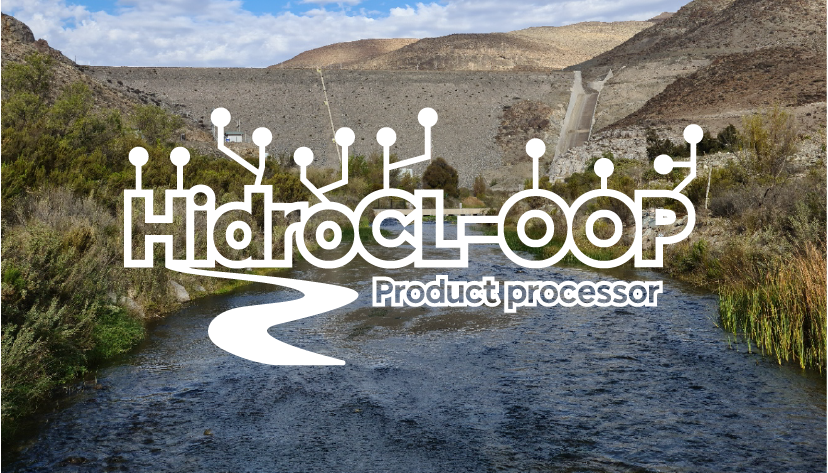

# Welcome to HidroCL-OOP

{: style="height:400px;width:700px"}

## What is HidroCL-OOP?

HidroCL-OOP is a Python package for downloading, extracting and
processing data from different sources. It is based on the
[workflow](workflow/) folder, which contains all the scripts for
downloading, extracting and processing data. The package is
designed to be used in a server, but it can be used in a local
machine.

This library was built to be used in the HidroCL model... *add description later*

## Installation

### Requirements

 - Python 3.10
 - R 4.1.2
 - [R packages](../../README.md)
 - [Python packages](../../requirements.txt) (installed automatically if needed)

## Configuration

### Set project path

````python
import hidrocl
hidrocl.set_project_path('/path/to/project')
print(hidrocl.paths.gfs)
>>> '/path/to/project/forecasted'
````

## Usage

### Upload database

First, set project path (`workflow/server/config.py`):

````python
project_path = '/path/to/project'
````

The project path should have the following structure:

 - base
   - boundaries*
     - Agr_ModisSinu.shp
     - HidroCL_boundaries_sinu.shp
     - HidroCL_boundaries_utm.shp
     - HidroCL_boundaries.shp
     - HidroCL_north.shp
     - HidroCL_south.shx
 - databases
   - discharge (optional)
   - forecasted (with all databases inside)
   - observed (with all databases inside)
   - staic (optional)
 - logs (empty or with all logs inside)
 - pcdatabases
   - discharge (optional)
   - forecasted (with all databases inside)
   - observed (with all databases inside)
   - staic (optional)

* shapefiles requires the following files: `.shp`, `.shx`, `.dbf`,
* `.prj`. Also, it should include `gauge_id` column.
 
Then, run the following command:

````bash
python workflow/server/run_all.py
````

### Run by steps

For each product, there is a script in `workflow/server` folder,
which checks, downloads and extracts the data. For example, for
`gfs` product, there is `workflow/server/gfs.py` script which
takes several databases (one for each atmospheric variable) and
process them.

Also, each folder in `workflow/` has individual scripts for each
step. For example, `workflow/download` has scripts for downloading
data from different sources only, and so on.