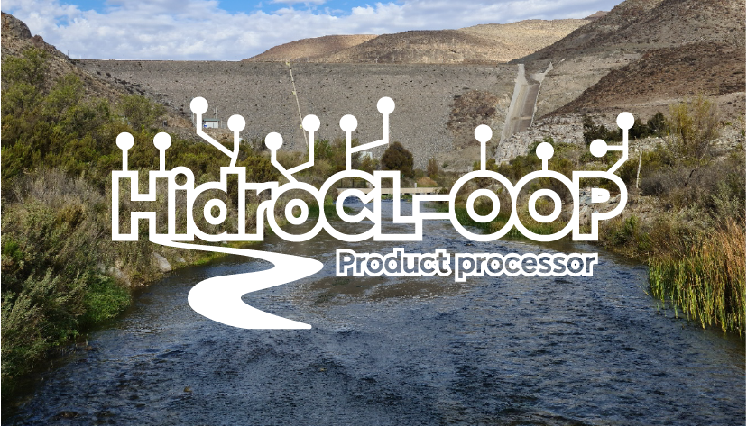

# Welcome to HidroCL-OOP

{: style="height:400px;width:700px"}

## What is HidroCL-OOP?

**HidroCL-OOP** is a Python library for downloading, pre-processing, and extracting hydrometeorological variables from satellite and climate reanalysis products, in order to build and maintain geospatial databases at the catchment scale for Chile.

The library integrates four main modules:

| Module | Description |
|---|---|
| `hidrocl.variables` | Management and querying of hydrometeorological variable databases |
| `hidrocl.download` | Download of satellite products and climate reanalysis data |
| `hidrocl.preprocess` | Pre-processing of raw data before extraction |
| `hidrocl.products` | Zonal statistics extraction per catchment |

Developed by the **Universidad de Valparaíso** and **Universidad de La Serena**, with funding from ANID through FONDEF IDeA I+D ID21i10093.

---

## Supported products

| Category | Product | Class |
|---|---|---|
| Vegetation | MOD13Q1, VNP13Q1 | `Mod13q1`, `Vnp13q1`, `Mod13q1agr`, `Vnp13q1agr` |
| Snow | MOD10A1F, VNP10A1F, MOD10A2 | `Mod10a1f`, `Vnp10a1f`, `Mod10a2` |
| Evapotranspiration | MOD16A2 | `Mod16a2` |
| Land cover | MCD12Q1 | `Mod12q1` |
| Leaf area index | MCD15A2H, VNP15A2H | `Mcd15a2h`, `Vnp15a2h` |
| Precipitation (observed) | GPM IMERG, IMERG GIS, PDIR-NOW | `Gpm_3imrghhl`, `ImergGIS`, `Pdirnow` |
| ERA5 reanalysis | ERA5 hourly | `Era5`, `Era5ppmax`, `Era5pplen`, `Era5_pressure`, `Era5_rh` |
| ERA5-Land reanalysis | ERA5-Land hourly | `Era5_land` |
| GFS forecast | GFS 0.25° | `Gfs` |
| GLDAS reanalysis | GLDAS Noah | `Gldas_noah` |

---

## Installation

```bash
pip install git+https://github.com/MeteorologiaUV/HidroCL-OOP/
```

**Requirements:** Python ≥ 3.10

---

## Configuration

### Set project path

```python
import hidrocl
hidrocl.set_project_path('/path/to/project')
```

### Project directory structure

```
project/
├── base/
│   └── boundaries/
│       ├── Agr_ModisSinu.shp
│       ├── HidroCL_boundaries.shp
│       ├── HidroCL_boundaries_sinu.shp
│       ├── HidroCL_boundaries_utm.shp
│       ├── HidroCL_north.shp
│       └── HidroCL_south.shp
├── databases/
│   ├── forecasted/
│   └── observed/
├── logs/
├── pcdatabases/
│   ├── forecasted/
│   └── observed/
└── products/
    └── observed/
```

Each shapefile must include a `gauge_id` column identifying the catchments.

### Credentials

**CDSAPI** (ERA5/Copernicus) — `~/.cdsapirc`:
```
url: https://cds.climate.copernicus.eu/api/v2
key: XXXXXXXXXXX
```

**Earthdata** (MODIS, VIIRS, GPM) — `~/.netrc`:
```
machine urs.earthdata.nasa.gov
    login XXXXXXXXXXX
    password XXXXXXXXXXX
```

**Environment variables** — `workflow/server/.env`:
```
PROJECT_PATH=/path/to/project
DOWNLOAD_SCRIPT_PATH=/path/to/workflow/server
DOWNLOAD_LOG_PATH=/path/to/logs
```

---

## Quick start

```python
import hidrocl
import hidrocl.paths as hcl

# Enable automatic database creation
hidrocl.variables.create = True

# Create variables
ndvi = hidrocl.HidroCLVariable("ndvi",
                               hcl.veg_o_modis_ndvi_mean_b_d16_p0d,
                               hcl.veg_o_modis_ndvi_mean_pc)
evi  = hidrocl.HidroCLVariable("evi",
                               hcl.veg_o_modis_evi_mean_b_d16_p0d,
                               hcl.veg_o_modis_evi_mean_pc)
nbr  = hidrocl.HidroCLVariable("nbr",
                               hcl.veg_o_int_nbr_mean_b_d16_p0d,
                               hcl.veg_o_int_nbr_mean_pc)

# Extract MODIS vegetation indices
mod13 = hidrocl.Mod13q1(ndvi, evi, nbr,
                        product_path=hcl.mod13q1_path,
                        vector_path=hcl.hidrocl_sinusoidal,
                        ndvi_log=hcl.log_veg_o_modis_ndvi_mean,
                        evi_log=hcl.log_veg_o_modis_evi_mean,
                        nbr_log=hcl.log_veg_o_int_nbr_mean)

mod13.run_maintainer()
mod13.run_extraction()
```

---

## Run the operational workflow

```bash
cd workflow/server/
python run_all.py   # all satellite + reanalysis products
python run_gfs.py   # GFS forecast (handles retries automatically)
```
